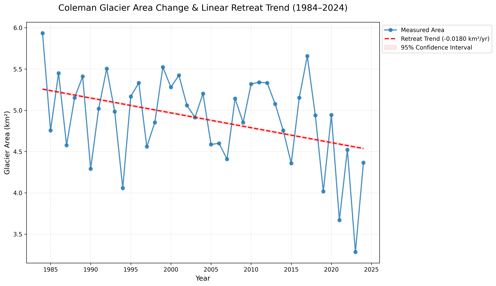

# Glacier Retreat and Streamflow Dynamics: A Case Study of the Nooksack River
This repository contains a multi-stage project investigating the relationship between glacial retreat, climate variability, and late-summer streamflow in the North Fork Nooksack River basin, Washington, USA.

The project integrates satellite remote sensing (Google Earth Engine), automated USGS data retrieval, and predictive machine learning to quantify how the loss of the Coleman Glacier impacts downstream water availability.

## 🏔️ Project Overview
As alpine glaciers retreat due to climate change, the timing and volume of downstream water delivery shift. This project develops a predictive modeling framework to isolate the drivers of late-summer streamflow, specifically focusing on the melt season (August–September) when glacial contribution is most critical to the ecosystem.

## Key Results
* Glacial Loss: Confirmed a 26% reduction in Coleman Glacier area since 1984.

* Hydrologic Shift: Detected a +27.1 day shift in the timing of peak late-summer discharge.

* Modeling: Developed a Random Forest model achieving an NSE of 0.68, identifying hydrologic memory and glacier area as primary predictors of discharge.

## 📂 Project Structure

The project is organized into data acquisition, analysis, and modeling phases:

```
glacier-streamflow-analysis/
├── data/                    # Processed CSVs (Glacier Area, Climate, Streamflow, Merged final dataset)
├── figures/                 # Saved visualizations for trends and model diagnostics
├── src/                     # Modular Python scripts for reusable logic
│   ├── modeling_utils.py    # Hydrologic metrics (NSE, KGE) and ML training logic
│   └── __init__.py          
├── 01_gee_glacier_extraction.ipynb  # Satellite remote sensing (GEE)
├── 02_streamflow_processing.ipynb   # USGS data retrieval & stationarity tests
├── 03_streamflow_modeling.ipynb     # Feature engineering & ML (RF/MLR)
└── README.md                # Project documentation and summary of findings
```

## Workflow
#### Glacier & Climate Extraction (`01_gee_glacier_climate_data.ipynb`)<br>
**Tools:** Google Earth Engine API, Landsat 5/7/8/9, PRISM Climate Data.
* Processed 40 years of satellite imagery to calculate annual glacier area using NDSI and NIR thresholds.
* Extracted catchment-scale temperature and precipitation from the PRISM dataset.
* **Finding:** Coleman Glacier is losing an average of 0.0180 km² per year (p = 0.0108).



#### Streamflow Processing (`02_streamflow_dataset.ipynb`)<br>
**Tools:** dataretrieval (USGS NWIS), statsmodels.
* Retrieved 40 years of daily discharge data for USGS Gauge 12205000.
* Performed Augmented Dickey-Fuller (ADF) tests to confirm stationarity for time-series modeling.
* **Finding:** Baseflow levels dropped significantly after 2021 thermal events (from ~22 m³/s to ~12 m³/s).


#### Machine Learning & Predictive Modeling (`03_streamflow_modeling.ipynb`)<br>
**Tools:** scikit-learn, RandomForestRegressor, Multiple Linear Regression.
* Engineered lagged features to capture "hydrologic memory" (basin storage).
* Configuration A (Full Feature Set): Achieved an NSE of 0.68, highlighting the importance of previous-day discharge.
* Configuration B (Reduced Features): Identified Glacier Area as a primary driver (~35% importance) when daily memory is removed.
* Evaluation: Used hydrologic-specific metrics: Nash-Sutcliffe Efficiency (NSE) and Kling-Gupta Efficiency (KGE).

## Model Performance Summary

| Metric | MLR (Config A) | MLR (Config B) | RF (Config A) | RF (Config B) |
| :--- | :---: | :---: | :---: | :---: |
| **R²** | 0.536 | 0.100 | **0.682** | 0.274 |
| **NSE** | 0.536 | 0.100 | **0.682** | 0.274 |
| **KGE** | 0.713 | 0.091 | **0.719** | 0.235 |
| **RMSE (m³/s)** | 5.882 | 8.190 | **4.872** | 7.357 |
| **MAE (m³/s)** | 2.364 | 4.768 | **2.141** | 4.689 |
| **PBIAS (%)** | 0.558 | -1.808 | 1.174 | 4.809 |


> **Note:** **Config A** includes lagged discharge and climate variables, while **Config B** focuses strictly on raw climate drivers and glacier area.


---

## Key Findings from Modeling

* The inclusion of lagged features (Config A) resulted in a massive performance boost. For the Random Forest, the Nash-Sutcliffe Efficiency (NSE) jumped from **0.27 to 0.68**, confirming that late-summer discharge is highly dependent on the previous state of the basin's storage.
* The Random Forest model consistently outperformed Multiple Linear Regression, particularly in capturing the non-linear relationship between retreating glacier area and baseflow.
* All models achieved excellent Percent Bias (PBIAS) scores within the ±5% range, which indicates that the models are highly effective at capturing the total volume of water, even when daily peaks vary.
* While the models are highly accurate at predicting baseflow (low MAE), the RMSE remains relatively high compared to MAE, suggesting the models still struggle to capture high-magnitude spikes caused by extreme weather events.

## Getting Started

Prerequisites
1. **Google Earth Engine Account:** You must have a GEE account to run the first notebook.
2. Environment requirements: `pip install -r requirements.txt`
3. Run `01_gee_glacier_climate_data.ipynb` to generate `glacier.csv` and `climate_variables.csv`.
4. Run `02_streamflow_dataset.ipynb` to generate `streamflow.csv`.
5. Run `03_streamflow_modeling.ipynb` to train models and view diagnostic plots.

---

## 📝 Author
**Michelle Kearney**, 2026 | [Linkedin](https://www.linkedin.com/in/michelle-kearney/)